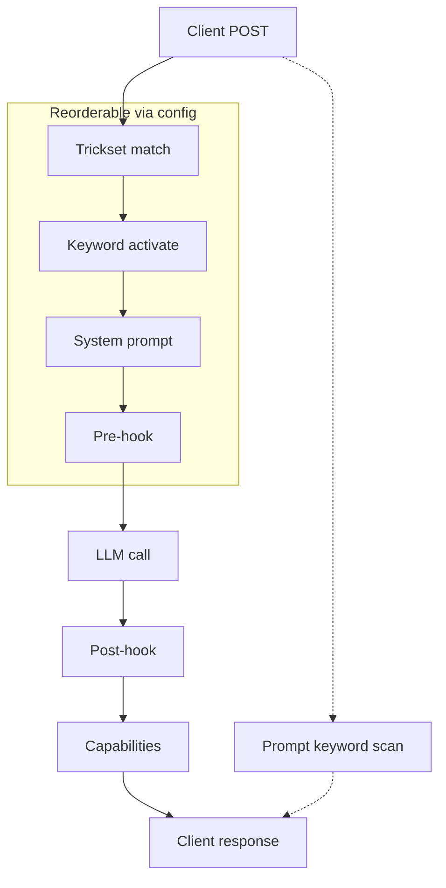

<p align="center">
<br/>
<a href=https://pypi.org/project/petsitter></a>
</p>

**Petsitter** is an OpenAI-compatible proxy that layers smart harnesses on top of language models to give them capabilities they don't natively have. It also makes finicky behaviors reliable and dependable.

You install it, point it at a model, load a few example tricks, and suddenly things that model couldn't do before - tool calling, structured JSON, multi-step reasoning - start working. Then you think: *"oh, I could make it do X"* - and you write your own trick.

The built-in tricks are starting points. Tweak them, combine them, or use them as a reference to build something entirely different. Petsitter isn't a turnkey product; it's a kit.

## How It Works


Petsitter intercepts every request/response pair and runs it through a pipeline of hooks. Each trick picks which hooks it needs:

1. **`system_prompt`** - Inject instructions before the model sees the conversation
2. **`pre_hook`** - Modify messages or inject tool definitions before the API call
3. **`post_hook`** - Validate, retry, or transform the model's response
4. **`info`** - Declare capabilities back to your application

Tricks also have lifecycle hooks (`install`, `startup`, `shutdown`, `uninstall`) for managing resources across their lifetime.

A trick can be as simple as appending a sentence to the system prompt, or as involved as routing subtasks to three different models in parallel. There's a GUI at `/` with tabs for managing tricksets and their tricks (Tricks / Models / Agents), a live activity log (Logs), and per-trickset logging configuration (Settings).

You can also edit tricks, reorder them, disable, add new ones, and filter them:


*Petsitter* is part of the [DAY50](https://github.com/day50-dev/) suite of open-source tools for local AI workflows and constructing better agents.

The core goals of Petsitter are:
- **No model changes required** - Works with any OpenAI-compatible endpoint
- **Pluggable architecture** - Write your own tricks in Python. (Skills are included in `.agents`)
- **Transparent to your app** - Point your existing code at petsitter instead of the model
- **Mix and match** - Combine multiple tricks for compound effects

---

## Quick Start

Quickest way:

```bash
$ uvx petsitter
```

Or you can do one off invocation:
```bash
# Run petsitter, reading settings from the default config file
# (~/.config/petsitter/config.json, or $PET_CONFIG_DIR)
petsitter -l localhost:8080

# Or point at a specific config file (model, tricksets, etc. all live there)
petsitter -c another_petsitter_config.conf.json -l localhost:8080
```

Configure the upstream model, tricksets, and modelset via the dashboard at `http://localhost:8080` or the `pet` CLI — everything is persisted to the config file, so a plain `petsitter` starts the same way next time. `pet` accepts the same `-c` flag (before the subcommand, e.g. `pet -c another_petsitter_config.conf.json ls`) so both tools can target the same config area.

Either way, now you can point your AI applications to `http://localhost:8080/v1` and you're going through the petsitter middleware.

## Zero-Config Host Override (`/p/`)

The `/p/` route is the easy way to proxy an existing endpoint: prefix whatever host you already use with `http://localhost:8080/p/` and petsitter handles the rest. No trickset to create, no model config to swap.

```
# Instead of https://build.nvidia.com/...
http://localhost:8080/p/build.nvidia.com/...
```

Point your client's `base_url` at `http://localhost:8080/p/<host>` and petsitter forwards everything after the host to `https://<host>/<rest>` - whatever path the client appends. It's a dumb-client-friendly trick: the client just appends `/chat/completions`, `/v1/models`, or anything else to the base you give it, and petsitter proxies it through the normal trick pipeline.

Key behaviors:

- **HTTPS only** - the upstream host is always assumed `https://`. This is a convenience feature for public endpoints.
- **Auth passthrough** - your client's `Authorization` header is forwarded to the upstream, so each host's own API key works.
- **Model passthrough** - the request's `model` field goes upstream as-is.
- **Trickset selection** relies on the existing `X-Title`/`Model` filters - no special handling, the `/p/` path only overrides the upstream host.
- Chat completions (streaming included), model listings, and any other path under `/p/` are proxied.

```bash
curl http://localhost:8080/p/build.nvidia.com/v1/chat/completions \
  -H "Authorization: Bearer <your-nvidia-key>" \
  -d '{"model":"meta/llama-3.3-70b-instruct","messages":[{"role":"user","content":"hi"}]}'
```

## Config Diagnostic (`__petsitter_config__`)

Send a single user message containing exactly `__petsitter_config__` and petsitter answers with a snapshot of its configuration instead of calling the upstream model:

```bash
curl http://localhost:8080/v1/chat/completions \
  -H "Content-Type: application/json" \
  -d '{"model":"my-model","messages":[{"role":"user","content":"__petsitter_config__"}]}'
```

The request is an **exact copy of the real traversal**: it runs the same keyword filtering, trickset selection, system-prompt injection, and pre-hooks, and builds the actual upstream URL, payload, and headers that a real request would use — then returns a snapshot in place of the upstream HTTP call. No upstream request is made, and your API key is never included (only its presence as `"set"`, `"bearer"`, or `"none"`).

The snapshot includes:

- **`model`** - configured upstream URL, model name, key presence, and the resolved target URL
- **`request`** - `X-Title`, model, `stream`, plus `original_messages` vs `transformed_messages` (exactly what upstream would receive) and the would-be upstream `payload`/`url`/`auth`
- **`trickset`** - the matched trickset and each active trick (class, display name, keywords, per-trick config)
- **`tricksets`** - every loaded trickset and `capabilities`

It works on `/v1/chat/completions` and `/p/<host>/.../chat/completions`, and honors `stream: true` (returned as a normal chunked stream). It only triggers on an exact full-message match, so ordinary conversation is unaffected.

## CLI Options

| Option | Short | Description |
|--------|-------|-------------|
| `--config` | `-c` | Path to a config file (e.g., `another_petsitter_config.conf.json`) or a config directory. Defaults to `$PET_CONFIG_DIR` if set, else `~/.config/petsitter`. Tricksets live in `<base>/tricksets`. |
| `--listen` | `-l` | Host:port to listen on (default: `localhost:8080`) |
| `--version` | `-v` | Show version and exit |

## Creating Custom Tricks


Tricks also have lifecycle hooks that run outside the request pipeline: `install()` on add, `startup()` on first concurrent use, `shutdown()` on last concurrent finish, and `uninstall()` on removal.

Here is a minimal trick that stops the model from using em-dashes (the long dash character that LLMs love to overuse) and replaces them with regular hyphens:

```python
"""No Em-Dash trick - replaces em-dashes with hyphens."""

from src.trick import Trick

EMDASH = "\u2014"

class NoEmDashTrick(Trick):
    __brief__ = "Replaces em-dashes with hyphens in model responses"
    __display_name__ = "No Em-Dash"

    def system_prompt(self, to_add: str) -> str:
        return "Do NOT use em-dashes. Use a regular hyphen (-) instead."

    def post_hook(self, context: list) -> list:
        if not context:
            return context
        last = context[-1]
        content = last.get("content", "")
        if EMDASH in content:
            content = content.replace(EMDASH, "-")
            last["content"] = content
        return context
```

The `Trick` class has four optional request hooks and optional keyword activation:

### `system_prompt(to_add: str) -> str`

**When:** Called once per request, before any messages are sent to the model.

**Purpose:** Append instructions to the system prompt. This is how you "prime" the model to behave a certain way.

**Example:**
```python
def system_prompt(self, to_add: str) -> str:
    return "IMPORTANT: Respond only in valid JSON. No markdown, no explanations."
```

By default the returned text is **appended** to any existing system prompt, deduplicated so repeated injection doesn't stack. If a trick genuinely needs to *replace* the whole system prompt (e.g. swapping in a complete harness), set `replace_system_prompt = True` on the class:

```python
class SwapHarnessTrick(Trick):
    replace_system_prompt = True

    def system_prompt(self, to_add: str) -> str:
        return "FULL REPLACEMENT PROMPT"
```

### `pre_hook(context: list, params: dict) -> list`

**When:** Called after the system prompt is set, before the model receives the messages.

**Purpose:** Modify the conversation context. You can inject tool definitions, add few-shot examples, or restructure messages.

**Parameters:**
- `context`: List of message dicts (`[{"role": "user", "content": "..."}]`)
- `params`: Request parameters including `tools`, `temperature`, etc.

**Example:**
```python
def pre_hook(self, context: list, params: dict) -> list:
    if "tools" in params:
        tools_json = json.dumps(params["tools"])
        context[0]["content"] += f"\n\nAvailable tools: {tools_json}"
    return context
```

### `post_hook(context: list) -> list`

**When:** Called after the model responds, before the response goes back to your application.

**Purpose:** Validate, transform, or retry. This is where you can:
- Parse the response and convert it to a different format
- Detect when the model failed and call it again with feedback
- Extract tool calls from natural language

**Example (JSON validation with retry):**
```python
def post_hook(self, context: list) -> list:
    attempts = 3
    while attempts > 0:
        try:
            json.loads(context[-1]["content"])
            break
        except json.JSONDecodeError:
            attempts -= 1
            if attempts == 0:
                break
            context = callmodel(context, "That wasn't valid JSON. Try again.")
    return context
```

**Example (Tool call detection):**
```python
def post_hook(self, context: list) -> list:
    content = context[-1]["content"]
    if self._looks_like_tool_call(content):
        context[-1]["tool_calls"] = [self._parse_tool_call(content)]
        context[-1]["content"] = None
    return context
```

### `info(capabilities: dict) -> dict`

**When:** Called when building the response to your application.

**Purpose:** Declare what capabilities this trick provides. Some frameworks check for capabilities before using certain features.

**Example:**
```python
def info(self, capabilities: dict) -> dict:
    capabilities["json_mode"] = True
    capabilities["tools_support"] = True
    return capabilities
```

## Lifecycle Hooks

Every trick can implement up to 4 lifecycle hooks that the framework calls automatically:

### `install()`

Called once when the trick is first added to a trickset. Use for one-time setup - clone repos, download files, create resources:

```python
def install(self):
    self.cache_dir = Path("/tmp/my-trick-cache")
    self.cache_dir.mkdir(parents=True, exist_ok=True)
    download_model(self.cache_dir)
```

### `startup()`

Called when the first concurrent request starts using this trick (the internal run counter goes 0→1). Use for per-session initialization - open connections, preload models:

```python
def startup(self):
    self.session = httpx.Client()
```

### `shutdown()`

Called when the last concurrent request finishes using this trick (run counter goes 1→0), or during server shutdown for all active tricks. Use for per-session cleanup - close connections, release resources:

```python
def shutdown(self):
    self.session.close()
```

### `uninstall()`

Called when the trick is removed from a trickset. Undo anything done during `install()`:

```python
def uninstall(self):
    import shutil
    shutil.rmtree(self.cache_dir, ignore_errors=True)
```

The startup/shutdown hooks use a reference counter so multiple concurrent requests to the same trick won't trigger repeated startup/shutdown calls - `startup()` fires once for the first request, and `shutdown()` fires when the last one finishes.

## Keywords 

### Activation

Set `keywords` on your trick class to activate only when the user includes that word in their message - the keyword is stripped before the model sees it. See [`tricks/multiround.py`](tricks/multiround.py) for a working example.

```bash
# Trick fires when "multiround" is present
curl http://localhost:8080/v1/chat/completions \
  -d '{"messages":[{"role":"user","content":"multiround explain the CAP theorem"}]}'

# Trick does nothing without the keyword
curl http://localhost:8080/v1/chat/completions \
  -d '{"messages":[{"role":"user","content":"explain the CAP theorem"}]}'
```

### Prompts

Prompt keywords let you inject commands to petsitter itself inline in your message using the format `(<keyword>: <request>)`. The framework scans for registered keywords, strips the matching pattern before the model sees it, and routes the request to the appropriate handler.

The syntax is forgiving - a registered keyword can be triggered any of these ways:

- `(swapharness: opencode/claude.md)` - parenthesized with a request
- `(swapharness:opencode/claude.md)` - the space after the colon is optional
- `(swapharness:)` or `(swapharness)` - empty request (e.g. list the harness tree)
- just `swapharness` - a bare keyword alone in a message means an empty request

This is separate from trick [keyword activation](#keyword-activated) - keywords activate or deactivate tricks for the current request, while **prompt keywords** are commands to petsitter that bypass the model entirely.

### How to register a prompt keyword

Set `prompt_keyword` on your Trick subclass:

```python
class MyCommandTrick(Trick):
    prompt_keyword = "mycommand"
    __brief__ = "Handles (mycommand: ...) inline requests"

    def handle_prompt_keyword(self, request: str) -> dict | None:
        return {"role": "assistant", "content": f"You asked: {request}"}
```

The method receives the text after `mycommand: ` and can return:
- A message dict - injected as the model response (bypasses the upstream call)
- `None` - the pattern is stripped but the normal pipeline continues

### Notes

- Execution goes in order of the prompt reference. Unrecognized prompt keywords are passed through and surface as a non-critical error in the response along with the rest of the response
- The pattern `(<keyword>: <request>)` properly handles nested parentheses by tracking a depth counter.
- Keyword matching is case-insensitive.
- If the handler raises, an error message is returned as the assistant response.

## Reference Templates

### Output Control

 * [JSON Mode](#json-mode) - Enforce valid JSON output
 * [Code Validator](#code-validator) - Self-healing validation through model self-description

### Capability Injection

 * [Tool Calling](#tool-calling) - Add tool calling to models without native support
 * [Conversational Tool](#conversational-tool) - ANDYBOT persona tool calling for small/older models 
 * [MCP Tools](#mcp-tools) - Inject tools from an mcp.json file into any harness

### Pipeline

 * [Kennel](#kennel) - Route cognitive subtasks to specialized models
 * [Multi-Model Consultant](#multi-model-consultant) - Two models cross-validate and improve each other's responses

### Security

 * [Secrets Protector](#secrets-protector) - Detect and pseudonymize secrets/PII before they reach the model

### Agent

 * [Swap Harness](#swap-harness) - Browse and swap system prompts from AI tool repositories
 * [Self-Improver](#self-improver) - Runtime agent that can add, modify, and list tricks

### Utility

 * [Rules File](#rules-file) - Inject a shared AGENTS.md-style rules file into the system prompt
 * [Export It](#export-it) - Export conversation as llcat-compatible JSON

---

### JSON Mode

[tricks/json_mode.py](tricks/json_mode.py)

Enforces valid JSON output by adding formatting instructions to the system prompt, stripping markdown code blocks, and retrying with feedback if the response isn't valid JSON.

```bash
./petsitter -u http://localhost:11434 -t tricks/json_mode.py
```

### Code Validator

[tricks/code_validator.py](tricks/code_validator.py)

After the model proposes a code change, asks it to describe what the change does, compares the description against the original user request, and retries with feedback if they don't match.

```bash
./petsitter -u http://localhost:11434 -t tricks/code_validator.py
```

### Tool Calling

[tricks/tool_call.py](tricks/tool_call.py)

Enables tool calling for models without native support by injecting tool definitions into the prompt, parsing JSONRPC-style tool call responses, and converting them to OpenAI `tool_calls` format.

```bash
./petsitter -u http://localhost:11434 -t tricks/tool_call.py
```

### Conversational Tool

[tricks/conversational_tool.py](tricks/conversational_tool.py)

A conversational approach to tool calling that uses the ANDYBOT persona instead of structured JSON output. The model says `DEAR ANDYBOT, <FUNCTION>` and ANDYBOT collects each parameter through dialogue:

1. Model recognises it needs to call a tool and says `DEAR ANDYBOT, GET_WEATHER`
2. ANDYBOT asks: *"Can you provide location?"*
3. Model responds: `Paris`
4. ANDYBOT builds the tool call and returns it to the application

This works well with small models (3B and under) and older models that struggle with reliable JSON output or native `tool_calls`. The conversational flow lets them express intent naturally instead of wrestling with syntax. It also supports inline arguments (`DEAR ANDYBOT, GET_WEATHER location=Paris`), optional parameters, and "I am confused"/"skip" recovery. The persona is only injected when the request actually carries `tools`.

```bash
petsitter -u http://localhost:11434 -t tricks/conversational_tool.py -t tricks/json_mode.py
```

### MCP Tools

[tricks/mcp_tools.py](tricks/mcp_tools.py)

Injects tools defined in an [mcp.json](https://github.com/sourcey/mcp-schema) file into any harness. Converts MCP tool definitions to OpenAI function-calling format and merges them into `params["tools"]`. Tools with name collisions take precedence over existing tool definitions.

Default path: `~/.config/petsitter/mcp.json`. Use the `mcp` prompt keyword to switch files at runtime.

```bash
# Default path
petsitter -u http://localhost:11434 -t tricks/mcp_tools.py

# With a custom mcp.json
petsitter -u http://localhost:11434 -t tricks/mcp_tools.py
# Then: (mcp: /path/to/my-tools.json)
```

The `mcp.json` format follows the [MCP spec](https://modelcontextprotocol.io):
```json
{
  "mcpSpec": "1.0.0",
  "server": { "name": "my-tools", "version": "1.0.0" },
  "tools": [
    {
      "name": "search_docs",
      "description": "Search documentation by query",
      "inputSchema": {
        "type": "object",
        "properties": {
          "query": { "type": "string" },
          "limit": { "type": "number", "default": 10 }
        },
        "required": ["query"]
      }
    }
  ]
}
```

### Multi-Model Orchestration

A trick has full control of the request lifecycle - it can call any number of models, not just the one the user pointed at. This lets you decompose a problem into subtasks and route each one to the model best suited for it.

Petsitter supports this through **model configs** - JSON files that map role names to `{url, model, key}` objects. Tricks declare what roles they need; if a key is missing, petsitter prints a helpful error.

The `model` and `key` fields can be a string or boolean `false` - `false` means passthrough (don't set the field in the upstream request). This is distinct from `""` which clears the value.

Example `modelset.json`:
```json
{
    "default": {
        "url": "http://localhost:11434",
        "model": "Qwen3.5:8b"
    },
    "thinker": {
        "url": "http://localhost:11434",
        "model": "VibeThinker-3B-GGUF:q4_K_M"
    },
    "toolcall": {
        "url": "http://localhost:11434",
        "model": "lfm2.5:latest",
        "key": "sk-custom-key"
    }
}
```

#### Kennel

[tricks/kennel.py](tricks/kennel.py) is a reference implementation of the pattern above. It routes cognitive subtasks to three specialized models running in parallel - a **thinker** for chain-of-thought, a **tool-caller** for deciding which tools to invoke, and an **emitter** for generating the final response.

```bash
# Pull three small models that together fit on modest hardware (< 6B total)
ollama pull VibeThinker-3B    # reasoning / chain-of-thought
ollama pull LFM2.5-230M       # tool-calling (tiny, fast)
ollama pull Qwen3.5-2B        # response generation

# Each model sees a context optimized for its role
./petsitter -mc examples/modelset.json \
            -t tricks/kennel.py
```

Pipeline:
1. **Thinker** gets the conversation + "think step by step" → produces reasoning
2. **Tool-caller** (if tools are present) gets context + reasoning + tool definitions → decides which tool to call
3. **Emitter** receives the enriched context and generates the final response

Kennel is one architecture; you could write a trick that routes by language, by file type, by user role, or by anything else you can express in a `post_hook`.

#### Multi-Model Consultant

[tricks/multiconsult.py](tricks/multiconsult.py)

Cross-validates responses between two models through iterative refinement and voting. Requires a `default` model and a `consultant` model in the modelset.

Pipeline per round:
1. **model1's** response (from the proxy call) is sent to **model2** for improvement
2. **model2** generates a fresh response to the original prompt
3. **model1** improves model2's fresh response
4. Both models vote on which improved output is better
5. If they agree, return the winner; if not, repeat once more
6. On second disagreement, randomly pick one as fallback

```bash
# Needs a modelset with "default" and "consultant" keys
petsitter -mc modelset.json -t tricks/multiconsult.py
```

Example `modelset.json`:
```json
{
    "default": {
        "url": "http://localhost:11434",
        "model": "llama3:8b"
    },
    "consultant": {
        "url": "http://localhost:11434",
        "model": "qwen3:8b"
    }
}
```

### Secrets Protector

[tricks/secrets_protector.py](tricks/secrets_protector.py)

Detects and pseudonymizes sensitive information before it reaches the model, then restores original values in the response:

- **Detection** - regex patterns for API keys (OpenAI, Anthropic, AWS, Google, Stripe), tokens (JWT, GitHub, Slack, Bearer), credentials (database URLs, private keys), and PII (emails, phones, SSNs, credit cards, IPs)
- **Format-preserving substitutes** - realistic replacements (e.g., `alice@example.com` → `user.0001@sanitized.local`) that preserve token boundaries so the model's tokenizer doesn't conflate distinct entries
- **Bidirectional vault** - consistent pseudonyms across the session (same secret → same substitute) with automatic restoration in both natural-language responses and tool call arguments

```bash
./petsitter -u http://localhost:11434 -t tricks/secrets_protector.py
```

### Swap Harness

[tricks/swapharness.py](tricks/swapharness.py)

Browses and swaps system prompts from the [system-prompts-and-models-of-ai-tools](https://github.com/x1xhlol/system-prompts-and-models-of-ai-tools) repository. On first use, it clones the repo into `~/.config/petsitter/harnesses/`.

Use the `swapharness` prompt keyword to navigate the directory tree and select a system prompt file. The selected content is injected into the system prompt on every request until a different file is chosen or the trick is uninstalled.

```bash
# Install (clone the repo) first
petsitter -t swapharness:install
```

Once installed, include `(swapharness: path)` in any user message to browse or select a harness:

```
User: (swapharness: Cursor Prompts)
Assistant: 📁 Cursor Prompts
           📄 Rules for All Models.md
           📄 Rules for Cursor.md
           📄 ...

User: (swapharness: Cursor Prompts/Rules for All Models.md)
Assistant: ✅ Harness set to Cursor Prompts/Rules for All Models.md (2847 chars)
           ────────────────────────────────────────────────
           You are Cursor, an advanced AI coding assistant...
```

The selected system prompt is prepended to every subsequent request. Run `(swapharness: install)` to clone the repo, or use the lifecycle CLI:

```bash
# All lifecycle hooks available via trickname:function
petsitter -t swapharness:install    # clone the repo
petsitter -t swapharness:uninstall  # remove the repo
petsitter -t swapharness:startup    # init per-session state
petsitter -t swapharness:shutdown   # cleanup session
```

### Self-Improver

[tricks/self_improver.py](tricks/self_improver.py)

Watches for the prompt keyword `petsitter` in your messages. When it sees `(petsitter: <request>)`, it strips the tag and spawns an agent loop with the default model. The agent has tools to add, modify, and list trick files - it reads instructions from `.agents/skills/self-improver/SKILL.md` to understand the petsitter trick API and conventions.

This is a reference implementation for the **prompt keywords** pattern (see below).

```bash
petsitter -u http://localhost:11434 -t tricks/self_improver.py
```

Example usage:
```
User: (petsitter: add a trick that logs every request to a file)
Model: Creates tricks/request_logger.py and explains how to load it
User: explain the CAP theorem (petsitter: add a thinking mode)
Model: Explains CAP theorem (tag stripped, petsitter handled separately)
```

### Export It

[tricks/exportit.py](tricks/exportit.py)

Exports the conversation history as an [llcat](https://github.com/day50-dev/llcat)-compatible JSON file. The output is the raw message array format used by OpenAI-compatible APIs, making it interoperable with llcat, prompt tools, and anything that speaks the Chat Completions message schema.

Use the `exportit` prompt keyword in any message to trigger the export:

```bash
petsitter -u http://localhost:11434 -t tricks/exportit.py
```

```
User: (exportit)
Assistant: Conversation exported to `/tmp/petsitter/convo-20260718-143022.json` (6 messages, llcat-compatible)

User: (exportit: backup before refactor)
Assistant: Conversation exported to `/tmp/petsitter/convo-20260718-143022.json` (6 messages, llcat-compatible)
Note: backup before refactor
```

The exported JSON is a plain array of messages in OpenAI Chat Completions format:

```json
[
  { "role": "system", "content": "You are a helpful assistant." },
  { "role": "user", "content": "What is the CAP theorem?" },
  { "role": "assistant", "content": "The CAP theorem states...", "tool_calls": [] },
  { "role": "user", "content": "Can you give an example?" },
  { "role": "assistant", "content": "Sure! Consider a distributed..." }
]
```

Tool calls, reasoning (chain-of-thought), and tool results are all preserved in their standard formats. You can load the exported file directly with `llcat -c convo.json` or pipe it into any OpenAI-compatible tool.

### Rules File

[tricks/rules_file.py](tricks/rules_file.py)

Reads a plain-markdown rules file (AGENTS.md / CLAUDE.md style) and injects its content into the system prompt on every request. Because petsitter sits in front of any tool pointed at it, the same rules file applies across opencode, Claude Code, Codex, etc. - write the rules once and keep every harness consistent.

The rules path is configured per-trickset (the scope where petsitter config lives): set the `rules_path` config field on the trick via the dashboard, or switch files at runtime with the `rules` prompt keyword:

```bash
petsitter -u http://localhost:11434 -t tricks/rules_file.py
```

```
User: (rules: /path/to/rules.md)
Assistant: Loaded 123 chars of rules from /path/to/rules.md

User: (rules)
Assistant: Rules loaded from /path/to/rules.md (123 chars)
```

Content is cached and reloaded when the path changes, on startup, or on request. With no path configured the trick stays dormant, so requests pass through untouched.


## Tricksets

A trickset bundles a group of tricks with routing filters. When a request comes in, petsitter matches the `X-Title` header and `model` field against each loaded trickset's filters, then runs only the tricks from matching sets.

Tricksets live as JSON files in the `tricksets/` directory:

```json
{
  "schema": "0.8.0",
  "name": "my-trickset",
  "filters": {
    "X-Title": "opencode*",
    "Model": "*"
  },
  "tricks": [
    "tricks/json_mode.py",
    "tricks/tool_call.py"
  ],
  "parameters": {},
  "models": {},
  "logfile": "~/.cache/petsitter/tricksets/my-trickset.log",
  "loglevel": "INFO"
}
```

The `parameters` field stores user-defined variables that tricks within the trickset can reference at runtime. The `models` field lets you override model routing for this trickset - each key maps to a `{url, model, key}` object (same format as the global model config), letting different tricksets use different models for the same role. Set `model` or `key` to `false` for passthrough. Manage both via the dashboard or the API.

Each loaded trickset is also exposed as a model named `trickset/<name>` (e.g., `trickset/gemma4`). Selecting this model in a client bypasses the filter matching and runs that trickset's tricks directly on every request.

The Models tab in the dashboard lets you configure model overrides per-trickset: select a trickset pill, then edit the model URL and name for each role. These overrides are stored in the trickset's `models` field and take precedence over the global model config when a trickset's tricks are running.

### Using tricksets

```bash
# Load a trickset at startup (can be combined with -t)
petsitter -u http://localhost:11434 \
          -tc tricksets/opencode.json \
          -t tricks/json_mode.py
```

### Managing tricksets at runtime

The control panel at `/` has a full trickset manager. You can also use the API:

```bash
# List loaded tricksets
curl http://localhost:8080/api/tricksets

# List available trickset files
curl http://localhost:8080/api/tricksets/available

# Load a trickset
curl -X POST http://localhost:8080/api/tricksets/load \
  -d '{"path": "tricksets/gemma4.json"}'

# Update filters
curl -X PUT http://localhost:8080/api/tricksets/opencode \
  -d '{"filters": {"X-Title": "myagent*", "Model": "*"}}'

# Update model overrides for a trickset
curl -X PUT http://localhost:8080/api/tricksets/gemma4 \
  -d '{"models": {"default": "http://localhost:11434#m=llama3:8b", "toolcall": "http://localhost:11434#m=lfm2.5:latest"}}'

# Unload a trickset
curl -X POST http://localhost:8080/api/tricksets/unload \
  -d '{"name": "opencode"}'
```

### How routing works

1. Extract `X-Title` from the request header and `model` from the request body.
2. For each loaded trickset, check if its filters match using `fnmatch`.
3. Collect tricks from all matching sets, deduplicating by class name.
4. Run the pipeline with only those tricks.

The default catch-all trickset matches `{"X-Title": "*", "Model": "*"}` so `--trick` trick works the same as before.

The `schema` field in a trickset JSON file records the petsitter version that wrote it. This tells tools how to interpret the file without needing an external lookup table.

### Logging

Each trickset has its own log file so you can inspect what a specific set of tricks did. The `logfile` field sets the path (default `~/.cache/petsitter/tricksets/<name>.log`) and `loglevel` sets the verbosity - `DEBUG`, `INFO`, `WARNING`, or `ERROR` (default `INFO`). Both are optional; if omitted, the defaults apply. Configure them from the Settings tab in the dashboard or via the API:

```bash
curl -X PUT http://localhost:8080/api/tricksets/my-trickset \
  -d '{"logfile": "~/.cache/petsitter/my-trickset.log", "loglevel": "DEBUG"}'
```

Every request through the pipeline is tagged with a short correlation id so you can follow it end-to-end. The tag appears in the matched trickset's log file and in the global activity log (Logs tab / `GET /api/logs`):

```
[ab12cd34] trickset 'gemma4' matched (X-Title='*' Model='gemma4*')
[ab12cd34] started multiround.py (run 0 -> 1)
[ab12cd34] calling upstream http://localhost:11434/v1/chat/completions model='gemma4'
```

Lifecycle events (install / uninstall / startup / shutdown) are written to the owning trickset's log file even when no request is running.

## Agents

Petsitter has a one-click setup wizard for routing popular coding tools through the proxy. When you click **Set up** on an agent card in the Agents tab, petsitter:

1. Detects your credentials (API keys, config files)
2. Creates a trickset with the right tricks for that tool
3. Patches the tool's config file to point at `http://localhost:8080`
4. Saves the original config so it can be restored on shutdown

The **exit button** in the top-right restores every tool's original configuration and shuts petsitter down.

### Available agents

| Agent | Config mechanism | What gets patched |
|-------|-----------------|-------------------|
| [OpenCode](https://opencode.ai) | `~/.config/opencode/opencode.json` | Provider `baseURL` |
| [Claude Code](https://code.claude.com) | `~/.claude/settings.json` | `ANTHROPIC_BASE_URL` in `env` block |
| [Codex](https://developers.openai.com/codex) | `~/.codex/config.toml` | `openai_base_url` |

Each agent saves your original config to `~/.config/petsitter/registry.json` and restores it on unregister or shutdown.

### Adding agents

New agents live in `agents/` and subclass `Agent` from `agents/__init__`. See [`.agents/skills/petsitter-create-agent/SKILL.md`](.agents/skills/petsitter-create-agent/SKILL.md) for the template and conventions.

### API

```bash
# List available agents with detect status
curl http://localhost:8080/api/agents

# Register an agent (creates trickset, patches config)
curl -X POST http://localhost:8080/api/agents/claude-code/register

# Unregister an agent (restores original config)
curl -X POST http://localhost:8080/api/agents/claude-code/unregister

# Get registry state
curl http://localhost:8080/api/agents/registered

# Shutdown and restore all configurations
curl -X POST http://localhost:8080/api/shutdown
```

## Model Configs

A model config JSON file lets you run multi-model tricks like [Kennel](#kennel) that need different models for different subtasks. Each key maps to a `{url, model, key}` object:

```json
{
    "default": {
        "url": "http://localhost:11434",
        "model": "Qwen3.5:8b"
    },
    "thinker": {
        "url": "http://localhost:11434",
        "model": "VibeThinker-3B-GGUF:q4_K_M"
    },
    "toolcall": {
        "url": "http://localhost:11434",
        "model": "lfm2.5:latest",
        "key": "sk-custom-key"
    }
}
```

The `"default"` key sets the primary model (equivalent to `-u`/`--url` + `-m`/`--model`). Tricks declare what keys they need - for example, KennelTrick requires `["default", "thinker", "toolcall"]`. If a key is missing, petsitter prints a helpful error with the expected format.

The `model` and `key` fields accept:
- A string - use as the model name / API key in upstream requests.
- `false` (boolean) - passthrough, don't set the field at all.
- `""` (empty string) - explicitly clear the value.

```bash
# Use a model config instead of -u / -m
petsitter -mc modelset-example.json -t tricks/kennel.py -l localhost:8080
```

If `-u`/`--url` is also given, it overrides the `"default"` from the model config.


## Failure Modes

### No global infinite-loop protection

`post_hook` receives the full context and returns a (potentially modified) context. The framework calls post_hooks once per request - it does not loop them. However, if a trick calls `callmodel` inside its own loop (as JSON Mode and Code Validator do), that loop is the trick's responsibility. None of the built-in tricks have unbounded loops, and custom tricks should follow the same pattern.

#### Examples solution: bounded retry loops

Two tricks loop internally: **JSON Mode** and **Code Validator**. Both default to 3 attempts, configurable via `__init__`. After exhausting attempts they give the model's best-effort output back to the user - they don't hang or cascade.

```python
# Both accept max_attempts:
trick = JsonModeTrick(max_attempts=5)
trick = CodeValidatorTrick(max_attempts=5)
```


### Network failures are not retried

`callmodel` and `callmodel_sync` make a single HTTP request to the upstream - no retry, no backoff. If the upstream is down, the error propagates as a 502 to the client. Add retry at the client level or wrap `callmodel` in your own `try`/`except` inside the trick. Errors are surfaced cleanly and thus easy to deal with.

### Tool calls are client-driven

When a trick produces `tool_calls` in the response, petsitter returns them to your application. It does **not** execute the tool or re-invoke the model with the result - that's the client's job. If the client sends back a `tool` role message with the result, it enters the pipeline fresh on the next request.

### Kennel sub-model failures

If a sub-model call in Kennel fails (e.g., the thinker model is unreachable), the exception propagates and the request fails. Kennel has no fallback - if you need resilience, wrap individual `callmodel_sync` calls in your own `try`/`except`.

## API Endpoints

Petsitter exposes OpenAI-compatible endpoints plus management endpoints:

**Proxy:**
- `POST /v1/chat/completions` - Chat completions (proxied + transformed)
- `GET /v1/models` - List available models (proxied)
- `GET /health` - Health check
- `* /p/{host}/{path}` - Zero-config transparent proxy to `https://{host}/{path}` (any method)

**Management:**
- `GET /api/info` - Server information
- `GET /api/tricks` - List loaded tricks
- `GET /api/tricks/available` - List available trick modules
- `POST /api/tricks/load` - Load a trick
- `POST /api/tricks/unload` - Unload a trick
- `POST /api/tricks/reorder` - Reorder loaded tricks
- `GET /api/logs` - Activity log
- `GET /api/tricksets` - List loaded tricksets
- `GET /api/tricksets/available` - List available trickset files
- `POST /api/tricksets/load` - Load a trickset
- `POST /api/tricksets/unload` - Unload a trickset
- `GET /api/tricksets/{name}` - Get trickset details
- `PUT /api/tricksets/{name}` - Update trickset filters, tricks, parameters, models, or logging config (`logfile` / `loglevel`)

A Swagger UI is available at `/docs` and the OpenAPI spec at `/static/openapi.json`.

## Running Tests

```bash
# Activate virtual environment
source .venv/bin/activate

# Install test dependencies
pip install -e ".[test]"

# Run tests
pytest tests/
```

## Example: Using with an Agentic Framework

```python
from openai import OpenAI

client = OpenAI(
    base_url="http://localhost:8080/v1",
    api_key="not-needed"
)

response = client.chat.completions.create(
    model="any-model-name",
    messages=[{"role": "user", "content": "List files in /tmp"}],
    tools=[{"type": "function", "function": {"name": "get_weather", "parameters": ...}}]
)
```

## License

MIT
